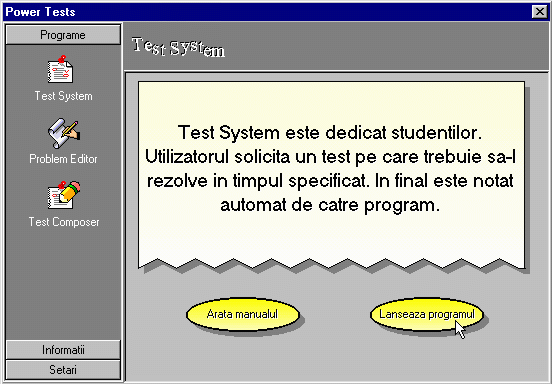
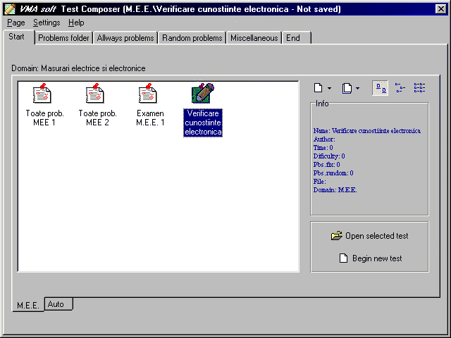

PowerTests
==========

Last updated: 1999

PowerTests is a desktop application for implementing online assessments in educational institutions (e.g. schools, universities, etc.)

A compiled version of this application can be found in [*/setup*](setup/) folder.

To rebuild the application from the Borland Delphi source code, please refer to [*/src*](src/) folder.

For the web based version please check [PowerTests.NET](http://github.com/mveteanu/PowerTests.NET)

Note: The application was originally built for usage in Romania.

